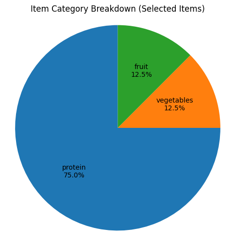
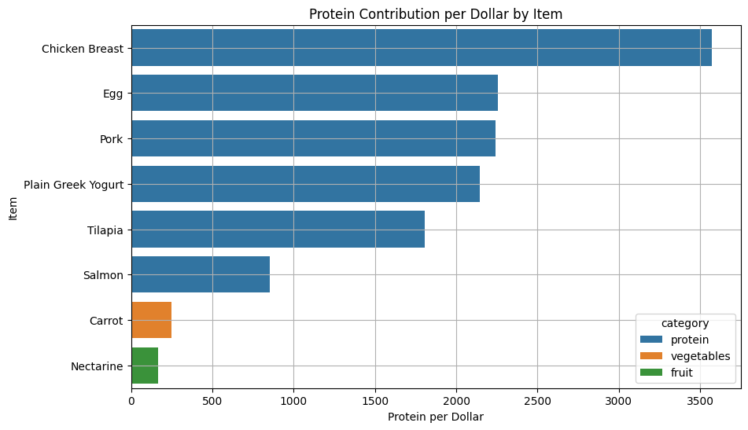

# Efficient Shopping Optimizer 🛒

## Overview

This project is a data-driven attempt to optimize grocery purchases for individuals who are both health-conscious and budget-aware. As someone who deeply values efficiency in both time and spending, I wanted to explore how computational methods—particularly **optimization algorithms**—can help us make better decisions in our everyday lives.

## Objective

Build a simple but effective tool that helps users select the best combination of grocery items under a fixed budget, **maximizing nutritional value** while minimizing cost.  
The project reflects my own dietary goals: protein-focused, clean eating, with minimal reliance on processed snacks.

## Problem Definition

Many grocery shoppers struggle to balance nutrition with affordability. For someone following a specific meal plan, it's often unclear which combination of items gives the best value for money while meeting dietary goals.

This project formulates the problem as a **0-1 Knapsack Optimization Problem**:
- Each food item has:
  - a **cost** (price per unit),
  - a **value** (e.g. grams of protein),
  - and a **category** (protein, carb, vegetable, etc.).
- The goal is to **maximize total nutritional value** (e.g. total protein intake) while staying within a budget.

## My Role and Motivation

As someone driven by efficiency in both time and cost, I wanted to quantify and automate decisions I used to make intuitively. This project bridges my background in **mathematics, statistics, and data science** with my personal interest in health and finance.

## Optimization Focus

The model can be customized to optimize for different nutritional goals or combinations such as:
- **Protein per dollar** (primary focus)
- **Fiber per dollar**
- **Calories per dollar**
- Or a weighted scoring system (e.g. 70% protein, 30% fiber)

> 💡 **Note**: Nutritional efficiency is measured per 100g, which may over- or underrepresent foods typically consumed in smaller or larger portions. Future work may adjust for realistic serving sizes to refine scoring metrics.
> 📌 **Protein Requirement Note**: The optimizer does not currently enforce a minimum protein threshold. However, a future interactive version may allow users to input their own body weight and activity level, calculating an individualized protein goal (e.g. 1.6–2.2g/kg body weight for active individuals).
> 📈 `protein_density` is scaled by 100 for readability and relative comparison. A density of 0.25 means 25g of protein per 100 kcal.

## Algorithm

The problem is solved using the **0-1 Knapsack algorithm**, which is suitable for binary decisions (either include the item or not).  
In future iterations, extensions like the **bounded knapsack** or **multi-objective optimization** can be applied.

## Next Steps

- Refine dataset (realistic prices, nutritional info, serving sizes)
- Implement optimization model
- Build UI or CLI to make the tool interactive

## Results

The final optimizer produces a budget-friendly and protein-rich shopping list that:

- Respects a fixed budget (e.g. **$120**)
- Satisfies nutritional constraints (e.g. **≥3500g protein/month**)
- Avoids monotony (e.g. no more than 4 of the same item)
- Ensures diversity (e.g. ≥2 protein sources, ≥1 vegetable, ≥1 fruit)

**Example Output (Store → Category → Item):**

```
ALDI:
  protein:
    - Chicken Breast x2 | $9.98 | Score: 38.2
    - Salmon Fillet x1  | $7.49 | Score: 26.4
  vegetables:
    - Carrot x1         | $1.29 | Score: 4.3
...

💵 Total Cost: $119.82  
💪 Total Weighted Protein Score: 183.5
```

> 🔧 Want to try your own constraints? Modify the Jupyter notebook `efficient_shopping_optimizer.ipynb` to fit your diet and preferences!

## Visualizations

Below are two supporting plots generated by the optimizer:

<p align="center">
  
  <br>
  <em>Figure 1. Distribution of selected items by category</em>
</p>

<br>

<p align="center">
  
  <br>
  <em>Figure 2. Protein contribution per dollar for each selected item</em>
</p>

## File Structure

```
efficient-shopping-optimizer/
│
├── data/
│   ├── efficient_shopping_optimizer_data.csv
│   ├── efficient_shopping_optimizer.xlsx
│   └── requirements.txt
│
├── figures/
│   ├── item_category_breakdown.png
│   └── protein_per_dollar.png
│
├── notebooks/
│   └── efficient_shopping_optimizer.ipynb
│
└── README.md
```

## How to Run

1. Install dependencies:
```bash
pip install pandas pulp matplotlib seaborn
```

2. Run the notebook:
- Open `notebooks/efficient_shopping_optimizer.ipynb`
- Execute all cells